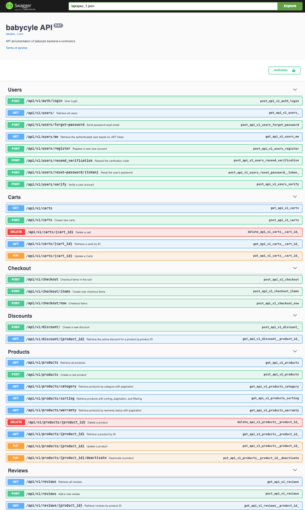

# Bima Rahman

 <!-- Ganti dengan gambar banner pribadi kamu -->

## 👋 Hi there, I'm Bima

### About Me
I am a meticulous and detail-oriented professional transitioning into software engineering. My background in administration has equipped me with strong organizational skills and an emphasis on accuracy in high-pressure environments. Through the Fullstack Software Engineering bootcamp program, I have developed technical skills in Python, HTML,CSS, SQL, JavaScript, and have worked with frameworks like React and Flask for application development. In addition, I have gained experience with version control through Git and developed RESTful APIs. For my final project, I focused on designing database structure and developing RESTful APIs to facilitate communication between the frontend and backend. The combination of these technical skills and soft skills enables me to develop software with accurate coding practices, allowing me to contribute significantly to projects and support the team in achieving their goals.

### 💼 Skills

- **Languages/Technologies**:
  - Python 
  - JavaScript 
  - TypeScript 
  - HTML 
  - CSS 
  - Node.js 

- **Frameworks/Libraries**:
  - React 
  - Flask 
  - Next.js 

- **Database Query Languages**:
  - SQL 

- **Databases**:
  - MySQL 
  - PostgreSQL 
  - MongoDB 

- **Tools**:
  - Git 
  - GitHub 
  - Docker 
  - Vercel 
  - Hostinger 

- **Soft Skills**:
  - Critical thinking
  - Attention to Detail
  - Problem-Solving
  - Adaptability

---

### 📂 Projects

#### Babycycle E-commerce Backend
- **Background**:  
  The idea behind **Babycycle** stems from the growing environmental concerns related to the overproduction of goods and the culture of consumerism. With the continuous production of new items, the planet suffers from rising emissions and resource depletion. The Babycycle project aims to address this issue by promoting the reuse of baby items that are still in good condition, but no longer used. Instead of buying new products, parents can sell or exchange their second-hand baby products on the platform, helping to reduce waste and decrease carbon emissions.

- **Description**:  
  I developed the backend for **Babycycle**, an e-commerce platform for buying and selling used baby items. Using **Flask** and **SQLAlchemy**, I designed the entity relationship diagrams (ERD), implemented RESTful APIs, and ensured the system was able to handle various operations like user registration, item listing, and transactions securely. The goal was to create a platform where parents can reduce waste, save money, and contribute to a more sustainable future.

- **Technologies**: Python, Flask, SQLAlchemy, SQL
- **Link**: [Babycycle E-commerce Backend](https://github.com/Group-D-Revou-Final-Project/babycycle-backend.git)

- **My Role & Responsibilities**:
  - **Designed Entity Relationship Diagrams (ERD)**: Visualized the data structures and established relationships between entities in the e-commerce database, enhancing the clarity of the database schema for the development team.
  - **Developed Data Models with ORM**: Used **Flask-SQLAlchemy** to create data models, establishing relationships between entities and improving the efficiency of data management and queries.
  - **Developed RESTful APIs**: Implemented RESTful APIs to facilitate communication between the frontend and backend of the e-commerce platform, ensuring smooth data exchange and enhancing system performance.
  - **Collaboration with Frontend Developers**: Worked closely with the frontend team to integrate the backend APIs, ensuring a seamless data flow and providing support for user interaction and experience.

- **Proyek Screenshot**:
  - 

---

### 💼 Work Experience

#### Administrative Staff, Perum Jasa Tirta II
**November 2021 – August 2023**

- Organized and maintained filing systems for essential documents, significantly enhancing efficiency and ensuring teams had timely access to critical information.
- Prepared draft letters for management review, contributing to more efficient internal and external communication, and facilitating quicker decision-making processes.
- Documented meeting minutes, facilitating effective communication and enhancing accountability within teams.
- Organized logistical arrangements for meetings, managing schedules and resources, which consistently led to enhanced participation and engagement among team members, ultimately fostering a more collaborative environment.

---

### 📊 GitHub Stats

---

### 📬 Contact Me

- **Email**: [bima270204@gmail.com](mailto:bima270204@gmail.com)
- **LinkedIn**: [Bima Rahman](http://www.linkedin.com/in/bima-rahman-a83624311)
- **WhatsApp**: [+6287876960449](https://wa.me/6287876960449)

Feel free to reach out if you'd like to collaborate on a project or just want to chat about technology!

Thanks for visiting my profile! 😄

<!--

**b1m4r/b1m4r** is a ✨ _special_ ✨ repository because its `README.md` (this file) appears on your GitHub profile.

Here are some ideas to get you started:

- 🔭 I’m currently working on ...
- 🌱 I’m currently learning ...
- 👯 I’m looking to collaborate on ...
- 🤔 I’m looking for help with ...
- 💬 Ask me about ...
- 📫 How to reach me: ...
- 😄 Pronouns: ...
- ⚡ Fun fact: ...
-->
